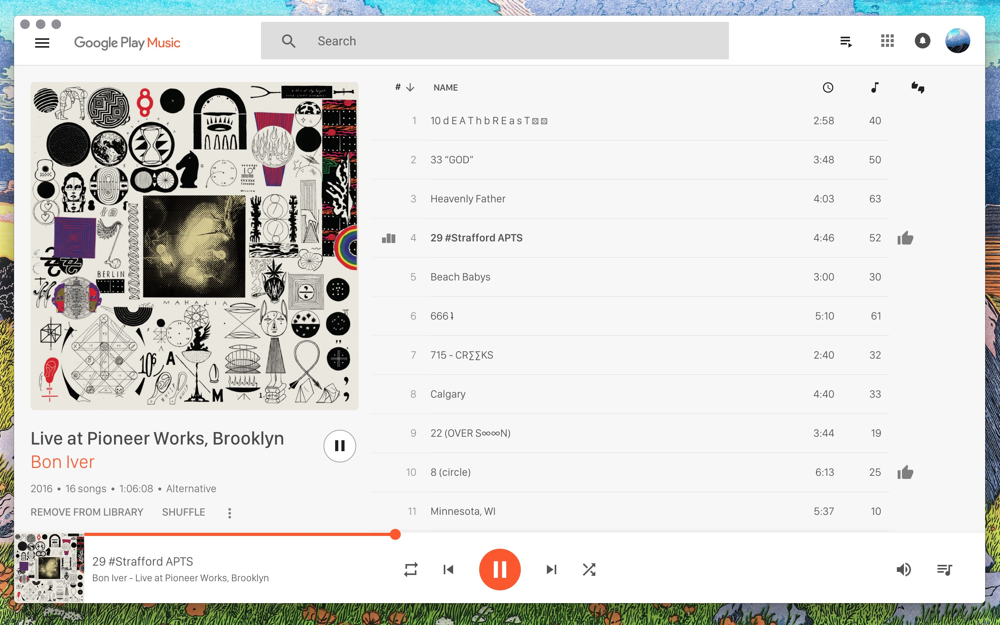

# Minimal desktop player for Google Music


## Google Play Music Wrapper
This is a UI wrapper for Google Music based on [Loop](https://github.com/twostairs/loop) and [electron-boilerplate](https://github.com/szwacz/electron-boilerplate) It is essentially like running Google Play Music in your Chrome browser, but as a native standalone app with some extra controls, nicer styles, and without having to use Flash.

When you start the app for the first time you will be prompted to sign in through Google's authentication system.  This is Google asking for your password information, the app does not save or read any login information.  (I recommend that you set up Google's 2-stage verification: https://www.google.com/landing/2step/ but it's not necessary).

# Install by downloading (option 1)

#### [Download the zipped .DMG](https://github.com/pmsaue0/play/releases) to install on OS X

# Install by building (option 2)

#### Clone/Fork this repo, then do a manual install with npm.
You can follow these steps if you want to build for OSX, Windows or Linux

### install dependencies
```
npm install
```
### run
```
npm run start
```
### build
```
npm run release
```
