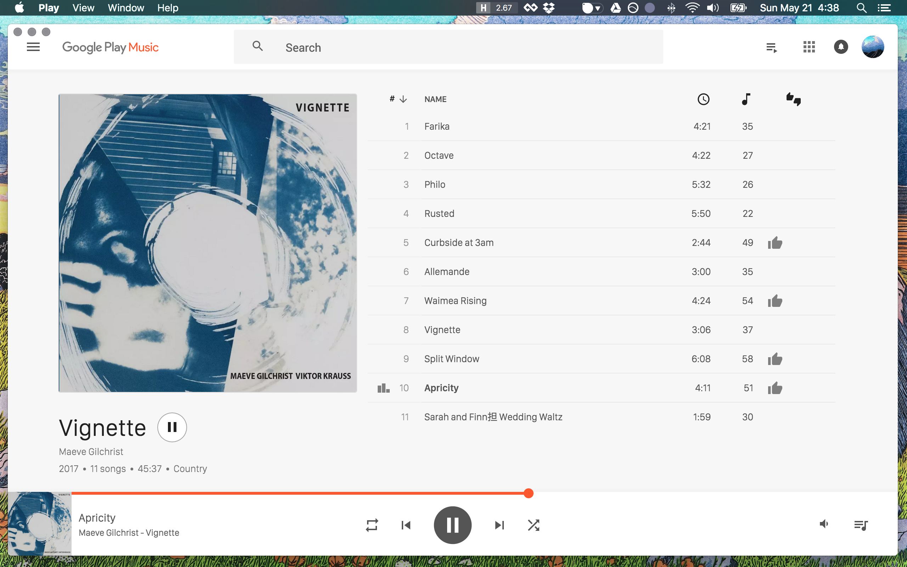

# Minimal desktop player for Google Music


## Google Play Music Wrapper
This is a UI wrapper for Google Music based on https://github.com/twostairs/loop  It is essentially like running Google Play Music in your Chrome browser, but with a native standalone app with some extra controls, nicer styles, and without having to use Flash.

When you start the app for the first time you will be prompted to sign in throught Google's authentication system.  (I recommend that you set up Google's 2-stage verification: https://www.google.com/landing/2step/ but it's not necessary).


### Install Method 1: [Download the zipped .DMG](https://github.com/pmsaue0/play/releases) to install on OS X

### Install Method 2: Clone/Fork this repo and do a manual install.
You can also follow these steps if you want to build for Windows or Linux

```
npm install
```
### run
```
npm run start
```
### Build
```
npm run release
```
